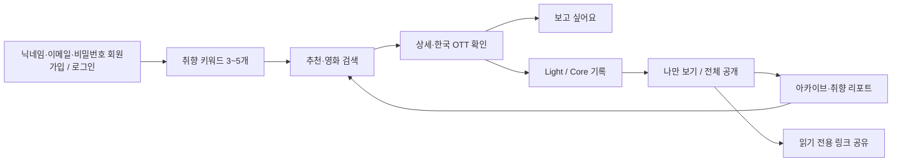
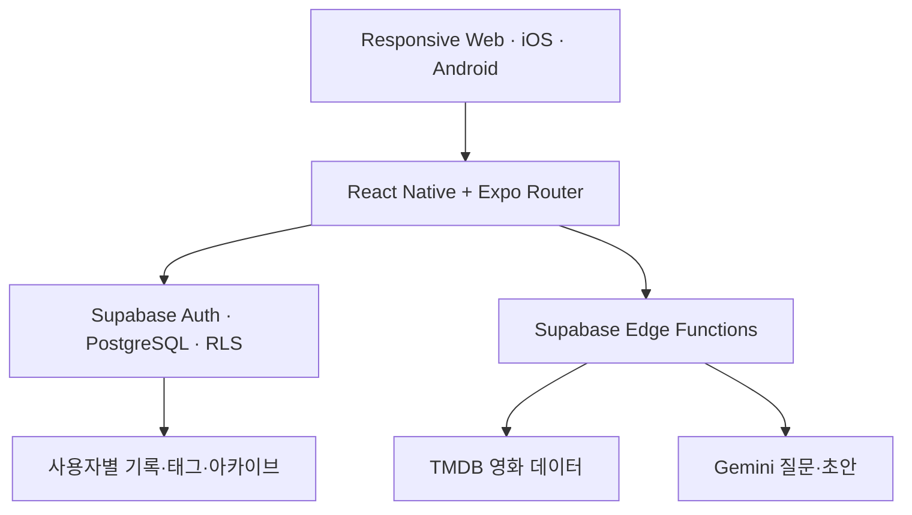

<div align="center">
  

  # FLICK

  **오늘의 감정으로 영화를 발견하고, 감상을 나의 언어로 남기는 영화 저널**

  긴 리뷰의 부담은 낮추고, 별점만으로 사라지는 감상의 결은 오래 보존합니다.

  [🌐 외부 베타 체험](https://flick-film-journal--beta.expo.app) ·
  [🎬 핵심 기능](#핵심-기능) ·
  [🧭 사용자 흐름](#사용자-흐름) ·
  [🗺️ 개발 현황](#개발-현황)

  
  
  
  
  
  
</div>

---

> [!NOTE]
> 현재 버전은 모바일 반응형 웹 외부 베타입니다. 이메일 계정으로 로그인하면 영화 탐색부터 Light/Core 기록, AI 초안, 아카이브, 취향 리포트와 읽기 전용 공유까지 실제로 테스트할 수 있습니다.

## 서비스 한눈에 보기

| 항목 | 내용 |
|---|---|
| 해결하려는 문제 | 한줄평은 감상을 충분히 남기기 어렵고, 장문 리뷰는 시작하기 부담스럽습니다. |
| 핵심 사용자 | 감정을 빠르게 남기고 싶은 `Light` 사용자와 영화를 깊이 해석하고 싶은 `Core` 사용자 |
| 핵심 가치 | 영화 발견과 감상 기록을 하나의 반복 가능한 습관으로 연결 |
| 차별점 | 장르보다 감정 키워드를 먼저 사용하고, AI가 글을 대신 게시하지 않고 질문과 초안만 보조 |
| 현재 플랫폼 | 모바일 우선 반응형 웹, iOS·Android로 확장 가능한 단일 Expo 코드베이스 |
| 현재 데이터 | TMDB 영화 검색·상세·한국 OTT 정보, Supabase 사용자 기록 |
| 공개 원칙 | 비공개가 기본이며, 전체 공개 완료 기록도 로그인 사용자에게 읽기만 허용 |

## 사용자 흐름



1. 닉네임·이메일·비밀번호로 회원가입하거나 기존 계정으로 로그인합니다. 기존 Magic Link 계정은 비밀번호 재설정으로 그대로 전환할 수 있습니다.
2. 지금 마음과 가까운 감정·취향 키워드 3~5개를 선택합니다.
3. 추천 또는 제목 검색으로 영화를 발견합니다.
4. 감독·출연진·제작·키워드·한국 OTT 정보까지 확인합니다.
5. 영화를 `보고 싶어요`에 저장하거나 바로 감상 기록을 시작합니다.
6. 상황에 따라 Light 또는 Core 기록을 선택합니다.
7. 완료 기록은 캘린더와 취향 리포트에 반영됩니다.
8. 전체 공개 기록은 다른 FLICK 사용자에게 읽기 전용 링크로 공유할 수 있습니다.

## 핵심 기능

### 감정에서 시작하는 영화 발견

- 첫 취향 키워드 3~5개 선택 및 재설정
- 키워드 기반 TMDB 영화 추천
- 한국어 영화 제목 검색과 공급자 실패 시 캐시 복구
- 영화 줄거리, 장르, 개봉일, 러닝타임과 평점
- 감독, 주요 출연진, 제작사, 제작 국가와 영화 키워드
- 한국 스트리밍·대여·구매 제공처 정보
- 사용자 계정별 `보고 싶어요` 저장과 재접속 복구

### Light 기록

- 영화 제목·장르·감독·주요 출연진에 맞춘 질문 5개
- 질문마다 최대 3개의 간단한 느낌 태그 선택
- 최소 3문항 태그 선택 후 기록 완료
- 별점, 감상일, 한 줄 감상과 자유 감상 추가
- AI 장애와 관계없이 질문 생성부터 저장까지 사용 가능

### Core 기록과 AI 보조

- 영화 메타데이터에 기반한 첫 질문 Q1
- 이전 질문과 사용자 답변을 연결한 Q2~Q5 순차 생성
- 각 답변을 수정하면 이후 질문을 다시 구성해 흐름 일관성 유지
- Q1~Q5에서 핵심 키워드 3~5개와 편집 가능한 리뷰 초안 생성
- 기존 자유 감상이 있으면 AI 초안 교체 전 재확인
- AI 결과를 사용자가 수정·승인하기 전에는 완료하거나 공개하지 않음
- AI 실패·무료 한도 초과 시 기존 입력 보존 및 안전 질문으로 복구

### 운영자 콘솔

- 서버에서 검증된 `super_admin` 계정만 마이 화면에서 접근
- 사용자·기록 조회와 기록 비공개 전환·삭제 권한을 각각 독립적으로 관리
- 초기값은 조회 전용이며 수정·삭제 권한은 명시적으로 켠 동안만 동작
- 사용자 작성문 직접 편집, 비밀번호 열람, 로그인 대행은 제공하지 않음
- 조회·권한 변경·비공개 전환·삭제를 감사 로그로 기록

### 5A 공개 콘텐츠 기반

- 모든 날짜의 Light/Core·초안/완료·공개범위를 한곳에서 관리
- 공개 기록에서 공감·저장, 500자 댓글과 한 단계 답글 제공
- 사용자별 중복 좋아요·저장·신고 방지와 본인 댓글 삭제
- 관리자 신고 기각 또는 기록 비공개 전환과 감사 로그
- 이메일·본문·사용자 ID 없이 공개 기록→영화 상세→새 기록 전환 측정

### 5B 읽고 반응하는 피드와 컬렉션

- 홈에서 공개 Light 리뷰 카드와 Core 매거진을 구분해 탐색
- 피드와 상세에서 공감·댓글·답글·저장 후 영화 상세로 이동
- 사용자 컬렉션 생성·수정·삭제, 나만 보기·전체 공개 전환
- 영화 검색 또는 영화 상세에서 컬렉션에 최대 100편 추가·제외
- 다른 사용자의 공개 컬렉션 저장과 내 컬렉션 화면 재조회

### 5C 랭킹과 편집 큐레이션

- 최근 7일의 공개 완료 리뷰를 기준으로 인기 영화와 최다 선택 키워드 집계
- 공개 리뷰 5건 미만이면 순위를 숨기고 표본 부족 이유와 집계 기간 표시
- 탐색 화면에서 원하는 감정을 고르면 추천 이유와 함께 영화 제안
- 운영자가 니치 큐레이션을 작성하고 영화를 최대 30편까지 순서대로 편집
- 전문가 큐레이션은 작성자·원문 출처·게시 권한 확인과 영화 1편 이상을 모두 충족해야 공개
- 큐레이션 원본과 랭킹 스냅샷은 직접 접근을 막고 인증·관리자 RPC로만 조회·변경

### 아카이브와 취향 리포트

- 월별 감상 캘린더와 날짜별 기록 확인
- Light/Core 필터와 완료 기록 재진입
- 전체 완료 편수, 이번 달 기록과 평균 별점
- 감정 TOP 3, 별점 분포와 기록 방식 비율
- 첫 기록 이후 두 번째 기록까지의 진행 안내
- 작성 중인 초안 이어쓰기 안내
- 리포트 요약 공유

### 데이터와 계정 관리

- 입력 후 0.9초 자동 초안 저장
- 서버 저장 실패 시 기기 복구본 유지
- 완료 필수값 누락 위치로 자동 스크롤 및 구체적인 안내
- 기록 수정·삭제와 연결 질문·답변·태그 일괄 정리
- 내 취향과 기록의 JSON 내보내기
- 이중 확인 계정 삭제와 로컬 FLICK 데이터 정리
- 본문·이메일을 제외한 최소 비식별 오류 메타데이터 보관

## Light와 Core 비교

| | Light | Core |
|---|---|---|
| 적합한 순간 | 감상을 빠르게 남기고 싶을 때 | 영화의 장면·인물·주제를 깊이 생각하고 싶을 때 |
| 진행 방식 | 영화별 질문 5개와 느낌 태그 | 답변에 따라 이어지는 Q1~Q5 |
| 최소 완료 조건 | 5개 질문 중 3개 이상 태그 선택 | Q1~Q5 각각 20자 이상 작성 |
| AI 필수 여부 | 필요 없음 | 질문·초안에 사용하지만 실패해도 수동 기록 유지 |
| 최종 글 | 태그, 한 줄 감상, 자유 감상 | 답변, 자유 감상, 편집 가능한 AI 리뷰 초안 |

## 공개 범위와 계정 권한

| 기록 상태 | 작성자 | 다른 로그인 사용자 | 비로그인 사용자 |
|---|---:|---:|---:|
| 초안 | 읽기·수정·삭제 | 접근 불가 | 접근 불가 |
| 완료·나만 보기 | 읽기·수정·삭제 | 접근 불가 | 접근 불가 |
| 완료·전체 공개 | 읽기·수정·삭제 | 읽기 전용 | 로그인 안내 |

- 모든 기록은 `나만 보기`가 기본값입니다.
- `전체 공개`를 선택해도 완료 전 초안은 공개되지 않습니다.
- 공유 링크는 편집 화면과 분리된 `/review/[id]` 읽기 전용 화면을 사용합니다.
- 다른 계정에는 입력·수정·삭제 요소를 렌더링하지 않습니다.
- 실제 저장·수정·삭제는 화면과 별개로 Supabase RLS에서 소유자를 다시 검증합니다.
- 현재 친구 관계 모델이 없으므로 `친구 공개`는 제공하지 않습니다.

## 데모와 이메일 계정 차이

| 기능 | 데모 | 이메일 계정 |
|---|---:|---:|
| 추천·검색·기록 화면 체험 | 가능 | 가능 |
| 기기 안의 기록 저장 | 가능 | 가능 |
| 서버 저장·다른 기기 복구 | 불가 | 가능 |
| 보고 싶어요 계정 저장 | 불가 | 가능 |
| Gemini 연계 질문·초안 | 불가 | 가능 |
| 외부 공개 기록 공유 | 불가 | 가능 |
| 다른 사용자의 공개 기록 읽기 | 불가 | 가능 |

## AI 운영 원칙

FLICK의 AI는 사용자의 글을 대체하는 작성자가 아니라, 생각을 이어주는 편집 보조 역할만 합니다.

| 기능 | 무료 테스트 한도 | 실패 시 처리 |
|---|---:|---|
| Core 연계 질문 | 하루 20회 · 분당 6회 | 안전 질문으로 복구 |
| Core 리뷰 초안 | 하루 5회 · 분당 2회 | 기존 답변과 본문 유지 |

- 사용자의 별도 동의와 버튼 입력이 있어야 AI를 호출합니다.
- 이메일, 한국 휴대전화, 주민등록번호 패턴은 전송 전에 차단합니다.
- Gemini 키와 TMDB 토큰은 Supabase Edge Function의 서버 비밀값에만 저장합니다.
- 감사 로그에는 기능, 상태, 오류, 모델, 토큰 수와 소요시간만 기록합니다.
- 질문·답변·생성 본문은 AI 감사 로그에 저장하지 않습니다.
- 무료 한도를 넘으면 유료 호출이나 자동 과금으로 전환하지 않습니다.

## 기술 구조



- **Language**: TypeScript strict mode
- **Client**: React 19, React Native, Expo SDK 57, Expo Router
- **Web**: Expo Web 정적 출력, 모바일 우선 반응형 UI
- **Backend**: Supabase Auth, PostgreSQL, Row Level Security, Edge Functions
- **Movie provider**: TMDB API와 주문형 상세 캐시
- **AI provider**: Gemini 무료 테스트 모델, 서버 전용 호출
- **Testing**: Vitest, TypeScript, Expo ESLint, Expo Doctor
- **Hosting**: Expo EAS Hosting beta alias

### 데이터 보존 방식

영화 공급자의 TMDB ID와 FLICK 내부 영화 UUID를 분리합니다. 공급자 상세정보가 갱신되거나 비활성화되어도 사용자의 `보고 싶어요`와 감상 기록은 내부 UUID를 계속 참조하므로 사라지지 않습니다.

TMDB 전체 상세를 무리하게 복제하지 않습니다. 검색된 영화의 상세정보는 사용자가 열 때 가져와 캐시하며, 전체 경량 색인은 Supabase Free DB 용량 보호를 위해 아직 적재하지 않았습니다.

## 프로젝트 구조

```text
src/app/                 화면, 탭, 상세와 딥링크 라우트
src/features/            영화 발견, 세션, 기록, AI, 리포트 도메인
src/components/          공통 UI 컴포넌트
src/lib/                 Supabase, 저장소, 비식별 진단
src/theme/               컬러·간격·타이포그래피 토큰
supabase/migrations/     RLS를 포함한 재현 가능한 DB 변경
supabase/functions/      TMDB, Gemini, 계정 삭제 서버 함수
tests/                   핵심 규칙과 보안 계약 회귀 테스트
docs/                    기획, 설계, 의사결정, 운영 인수인계
```

## 로컬 실행

### 요구사항

- Node.js 20 이상
- npm

```bash
git clone https://github.com/hoya0328/flick.git
cd flick
npm install
cp .env.example .env.local
npm run web
```

Windows PowerShell에서는 `cp` 대신 다음 명령을 사용할 수 있습니다.

```powershell
Copy-Item .env.example .env.local
```

`.env.local`에는 공개 클라이언트 설정만 입력합니다.

```dotenv
EXPO_PUBLIC_SUPABASE_URL=
EXPO_PUBLIC_SUPABASE_PUBLISHABLE_KEY=
```

`service_role`, Gemini API Key, TMDB 토큰, 데이터베이스 비밀번호는 클라이언트 환경변수나 Git에 넣지 않습니다.

## 검증 명령

```bash
npm run typecheck
npm run lint
npm test
npm run check
npm run build:web
```

현재 검증 기준:

- TypeScript strict 검사 통과
- Expo ESLint 통과
- Vitest 테스트 48개 통과
- Expo Doctor 20/20 통과
- 정적 웹 경로 24개 빌드 성공
- 운영 Supabase 사용자 테이블 RLS 활성화 확인
- 공개 기록 화면에서 비소유자 편집 입력 0개 확인
- 390px·480px 외부 베타 화면 가로 넘침 없음

## 개발 현황

- [x] **1단계** — Expo 기반, 이메일·비밀번호 회원가입/로그인, 닉네임, 감정 키워드 온보딩
- [x] **2단계** — TMDB 추천·검색·상세, 한국 OTT와 보고 싶어요
- [x] **2.5단계** — 주문형 상세 캐시와 사용자 기록 보존 구조
- [x] **3A** — 감상일·별점, 자동 초안, 목록·수정·삭제
- [x] **3B** — Light/Core 기록 화면과 완료 검증
- [x] **3C 질문** — Light 영화별 질문·태그, Core Q1~Q5 연계 질문
- [x] **3C 초안** — 키워드 정리와 편집 가능한 AI 리뷰 초안
- [x] **3C 운영 보호** — 호출 한도, 개인정보 차단, 안전 필터와 감사 메타데이터
- [x] **4단계 웹** — 캘린더, 취향 리포트, 공유, 내보내기와 계정 삭제 UI
- [x] **5A** — 공개 기록 피드 기반, 공감·댓글·답글·저장·신고와 관리자 조치
- [x] **5B** — Light/Core 홈 피드와 사용자 영화 컬렉션
- [x] **5C** — 최근 7일 랭킹, 감정 탐색, 니치·전문가 편집 큐레이션
- [x] **외부 베타** — 고정 beta URL, 로그인 복귀와 읽기 전용 공개 기록
- [ ] **출시 준비** — 일회용 2계정 권한 통합 테스트와 계정 cascade 삭제 검증
- [ ] **iOS** — Apple 로그인, 원본 앱 아이콘, TestFlight와 App Store 점검
- [ ] **Android** — iOS·웹 지표 확인 후 공개 빌드

### 현재 베타의 명확한 범위

- 영화만 지원하며 TV 드라마·시리즈는 아직 지원하지 않습니다.
- OTT는 제공처 정보이며 FLICK 안에서 콘텐츠를 재생하지 않습니다.
- 공개 피드·댓글·공감·저장·컬렉션은 제공하며 친구·팔로우·알림은 아직 없습니다.
- 랭킹은 공개 완료 리뷰가 최근 7일 동안 5건 이상 모였을 때만 노출됩니다.
- 전문가 큐레이션은 권리가 확인된 실제 콘텐츠를 운영자가 등록하기 전에는 비어 있습니다.
- Apple 로그인과 네이티브 앱스토어 배포는 준비 단계입니다.
- 전체 TMDB 영화 경량 색인 적재는 무료 DB 용량 승인 전까지 보류합니다.

## 프로젝트 문서

- [서비스 방향과 MVP](./docs/PROJECT_CONTEXT.md)
- [기술·데이터·권한 설계](./docs/ARCHITECTURE.md)
- [1~4단계 개발 로드맵](./docs/ROADMAP.md)
- [주요 제품·기술 결정](./docs/DECISIONS.md)
- [릴리스 점검표](./docs/RELEASE_CHECKLIST.md)
- [최신 배포와 다음 작업](./docs/HANDOFF.md)

## 데이터 출처와 고지

영화 정보와 이미지는 [TMDB](https://www.themoviedb.org/)를 사용합니다. OTT 제공 정보는 TMDB가 전달하는 JustWatch 데이터를 기반으로 표시합니다.

> This product uses the TMDB API but is not endorsed or certified by TMDB.

## 포트폴리오 노트

FLICK는 기능을 많이 나열하는 대신, **발견 → 감상 → 기록 → 회고 → 재발견**의 제품 루프를 실제 외부 사용자가 경험할 수 있게 만드는 데 집중했습니다.

기획 문서와 화면 구성에서 출발해 반응형 UI, 사용자별 데이터 권한, 외부 영화 API, AI 비용·안전 경계, 운영 가능한 배포와 QA까지 하나의 제품 흐름으로 연결한 프로젝트입니다.

---

<div align="center">
  <strong>발견은 가볍게, 감상은 오래 남도록.</strong><br />
  <a href="https://flick-film-journal--beta.expo.app">FLICK beta 시작하기</a>
</div>
